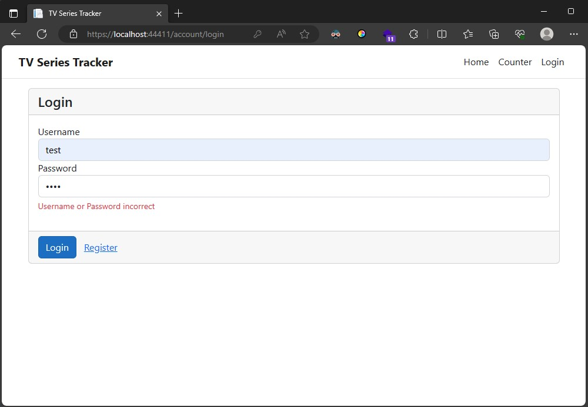
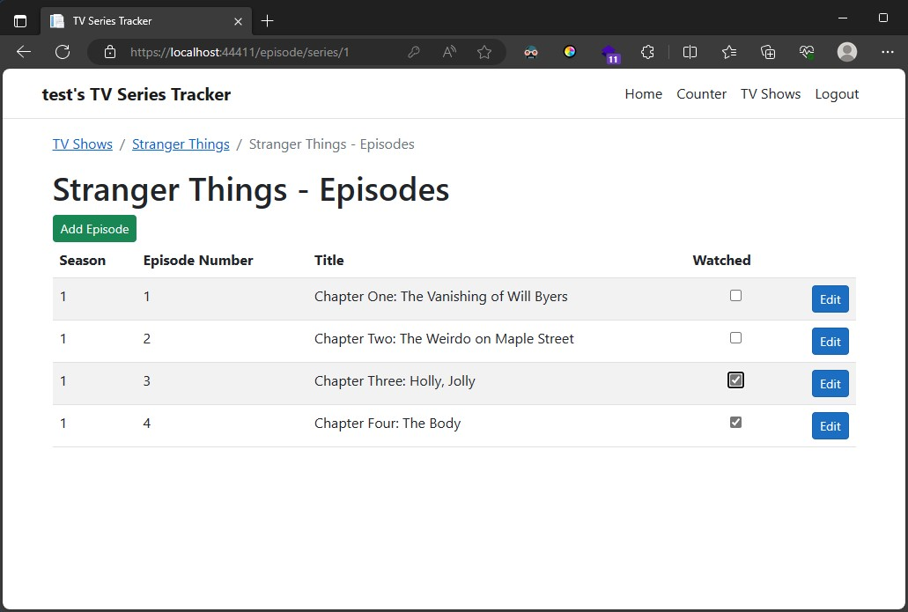
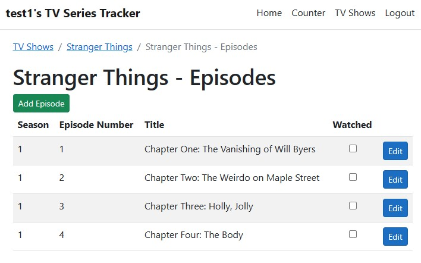

  
Original Assignment Spec...

  # Overview

  The goal of this task is to create a site to allow users to track the TV shows they have watched.
  
  A study has shown that users spend a lot of time watching the beginning of an episode before they realize they have seen it.
  
  Netflix isn't ubiquitous yet. Let's make this easier for them.

  # Requirements

  1. Create an SPA or server-side rendered client in your choice of Vue or React.
  1. Build an API.
  1. A database to hold users, the shows they watch and track the episodes.

  # Required Actions

  1. Login
  1. Show list - Show next episode to watch.
  1. Add/Remove show
  1. Enable episode to be marked as watched.

  ## Additional Points

  - Integrated with IMDB to pull details of the show, available episodes, make search easier for adding a show or add icons for the shows.
  - Deployed to Netlify, Azure, AWS, etc.

  ## Delivery

  The applicant has 3 days to complete the above tasks.
  Please supply the following when the task is complete:

  1. Packaged binaries ready to be run.
  1. Source code with .git folder included. Want to see your commit history, project structure and included files.

  
Setup Steps...

  All dependencies(server, client & database) should install automatically on initial build of the solution.
  There is no seed for the db, so the data has to be manually created via the UI.

  
Release Notes...

  All secure routes are hidden and the API endpoints unaccessable without a JWT that gets created with each successful login.

  Validation on all forms, custom error messages and cookie stored login JWT auth token.
  

  Stores all created/updated series and episodes, with a unique watched list per user.
  

  All user specific lookups, first decode the user auth token for the unique user GUID, to limit brute force access from another account.
  

